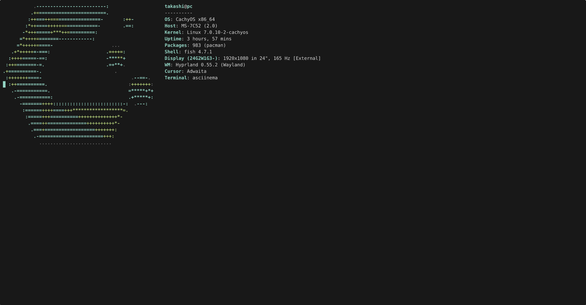

<div align="center">

```
 █████╗ ██╗   ██╗██████╗ ██╗██╗   ██╗███╗   ███╗
██╔══██╗██║   ██║██╔══██╗██║██║   ██║████╗ ████║
███████║██║   ██║██║  ██║██║██║   ██║██╔████╔██║
██╔══██║██║   ██║██║  ██║██║██║   ██║██║╚██╔╝██║
██║  ██║╚██████╔╝██████╔╝██║╚██████╔╝██║ ╚═╝ ██║
╚═╝  ╚═╝ ╚═════╝ ╚═════╝ ╚═╝ ╚═════╝ ╚═╝     ╚═╝
```

**A terminal music player.**

[](https://crates.io/crates/audium)
[](https://aur.archlinux.org/packages/audium)
[](LICENSE)

[Website](https://takashialpha.github.io/audium) · [Installation](#installation) · [Keybindings](#keybindings) · [Building](#building-from-source)

</div>



## Features

- **Keyboard-driven** — every action is one key. No mouse required.
- **Track metadata** — artist, album, year and genre are read automatically from file tags on import and shown throughout the UI. Edit any field in-app with `e`.
- **Lyrics** — store plain text or LRC synced lyrics per track. Toggle an overlay with `y` — synced lyrics auto-scroll to the current line; plain lyrics scroll with `j`/`k`. Edit directly in the built-in text editor.
- **It's your library** — your tracks are stored as plain JSON at `$XDG_DATA_HOME/audium/library.json` (typically `~/.local/share/audium/library.json`). Edit it by hand, back it up, move it anywhere. audium doesn't rename your files and never phones home.
- **Themes** — 15 built-in themes (dark, light, nord, gruvbox, catppuccin, rosé pine, dracula, tokyo night, and more). Switch live from the settings menu with instant preview. Transparency support for composited terminals.
- **Playlists** — create, rename, delete. *All Tracks* is always there.
- **Loop modes** — off, loop queue, or loop track. Toggle with `l`.
- **Playback speed** — adjustable from 0.05× to 3.0× in 0.05× steps with `[` / `]`.
- **Tracklist filter** — press `/` to search across title, artist, album, year and genre in real time.
- **Built-in file picker** — import audio files without leaving the app.
- **Threaded audio** — playback runs on its own thread; the UI never stutters your music.
- **System audio output** — audium plays through your default system output. Change the output device in your OS and audium follows — no in-app device switching, no surprises.
- **Format agnostic** — MP3, FLAC, OGG, WAV, AAC, M4A, Opus, AIFF and more via [Symphonia](https://github.com/pdeljanov/Symphonia). No FFmpeg required.
- **Tiny binary** — ~3 MB stripped release build.

---

## Installation

### Cargo

```sh
cargo install audium
```

Requires a Rust toolchain with edition 2024 support. Installs the `audium` binary to `~/.cargo/bin/`.

On Linux, ALSA is required to run and its development headers are required to build — see [Building from source](#building-from-source) for distro-specific instructions.

### AUR (Arch Linux)

```sh
paru -S audium
# or: yay -S audium
```

---

## Usage

```sh
# Launch with your library
audium

# Open a specific file immediately (imports it to your library)
audium path/to/song.flac
```

audium stores your library at `$XDG_DATA_HOME/audium/library.json` and your music at `$XDG_DATA_HOME/audium/music/` (typically under `~/.local/share/audium/`).

---

## Keybindings

### Global

| Key          | Action                   |
|--------------|--------------------------|
| `q`          | Quit (confirm)           |
| `Tab`        | Cycle panel focus        |
| `?`          | Toggle help overlay      |

### Playback

| Key          | Action                            |
|--------------|-----------------------------------|
| `Space`      | Play / Pause                      |
| `n`          | Next track                        |
| `N`          | Previous track                    |
| `←` / `→`   | Seek backward / forward           |
| `+` / `=`   | Volume up                         |
| `-`          | Volume down                       |
| `l`          | Cycle loop mode                   |
| `[` / `]`   | Speed down / up (0.05× steps)     |

### Navigation

| Key          | Action                   |
|--------------|--------------------------|
| `j` / `↓`   | Move cursor down         |
| `k` / `↑`   | Move cursor up           |
| `Enter`      | Play selected track      |

### Library & Queue

| Key  | Action                              |
|------|-------------------------------------|
| `f`  | Open file picker                    |
| `/`  | Filter tracklist                    |
| `a`  | Add selected track to queue         |
| `p`  | Add selected track to a playlist    |
| `c`  | Create new playlist                 |
| `z`  | Shuffle playlist into queue         |
| `d`  | Remove selected item                |
| `r`  | Rename selected track or playlist   |
| `e`  | Edit track metadata & lyrics        |
| `y`  | Toggle lyrics overlay               |
| `m`  | Open menu                           |

---

## Building from source

```sh
git clone https://github.com/takashialpha/audium
cd audium
cargo build --release
# binary is at ./target/release/audium
```

Requires ALSA and its development headers:

```sh
# Debian / Ubuntu
sudo apt install alsa-base alsa-utils libasound2-dev

# Arch
sudo pacman -S alsa-utils alsa-lib

# Fedora
sudo dnf install alsa-utils alsa-lib-devel
```

> **Linux only:** audium targets Linux exclusively; other platforms are not supported.

---

## Library layout

```
$XDG_DATA_HOME/audium/   # typically ~/.local/share/audium/
├── library.json   # track registry + playlists
├── settings.json  # user preferences (volume, theme, seek step)
└── music/         # copies of all imported audio files
```

`library.json` is human-readable and editable by hand. audium re-validates it on next launch, so feel free to reorganise playlists, fix track names, or move the file to another machine.

---

## Why audium?

Alternatives like termusic and cmus are solid, but they come with tradeoffs: heavy dependency trees, FFmpeg requirements, daemon processes, or configuration formats that take longer to learn than the app itself. audium is different in a few concrete ways:

- **No FFmpeg, no daemon** — one binary, zero background processes.
- **Smaller and faster to build** — fewer dependencies means shorter compile times and a ~3 MB release binary.
- **Cleaner UI** — built on ratatui with a layout designed for actual daily use, not just feature completeness.
- **More modern codebase** — written in current Rust with edition 2024, Symphonia for decoding, and rodio for playback.
- **Plain JSON library** — your data is always readable, portable, and yours.

## TODO

- YouTube audio import (no external binary deps)

## Contributing

Issues and pull requests are welcome.
Please open an issue before starting work on a large change.
